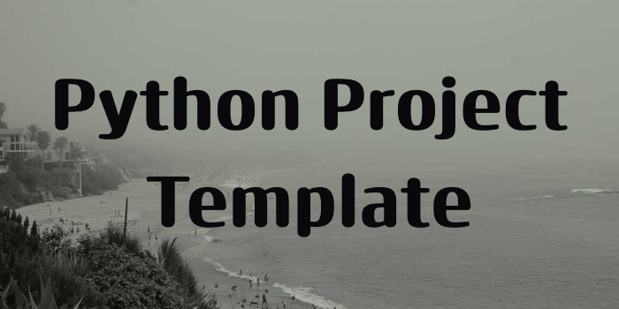

# Unhinged

<p align="center">
  
</p>

<p align="center">
<b>AI-Powered Dating Profile Analysis & Automation System</b>
</p>

<p align="center">
  Automated profile extraction, photo analysis, and comprehensive feature inference using advanced AI agents.
</p>

<p align="center">
  <a href="#key-features">Key Features</a> •
  <a href="#how-it-works">How It Works</a> •
  <a href="#requirements">Requirements</a> •
  <a href="#quick-start">Quick Start</a> •
  <a href="#configuration">Configuration</a> •
  <a href="#usage">Usage</a> •
  <a href="#architecture">Architecture</a> •
  <a href="#ethical-considerations">Ethics</a>
</p>

<p align="center">
  
  
  
  
  
</p>

---

<p align="center">
  
</p>

## Overview

**Unhinged** is an AI-powered system that automates profile analysis from the Hinge dating app. It combines mobile automation (ADB), computer vision, and large language models to extract detailed insights from dating profiles that go beyond what's explicitly stated.

The system captures profile information from Android devices, analyzes photos using AI, and generates comprehensive reports including inferred personality traits, lifestyle preferences, and dating style classification.

## Key Features

### 🤖 Intelligent Mobile Automation
- **ADB-based device control** - Automated swiping, tapping, and screenshot capture
- **XML UI hierarchy parsing** - Precise element location and interaction
- **Smart photo detection** - Automatically identifies and captures all profile photos
- **Complete profile extraction** - Age, location, height, job, education, prompts, and more

### 🎨 Advanced Photo Analysis
- **Multi-photo feature extraction** - Analyzes physical attributes, style, and context
- **Activity & location inference** - Detects settings, activities, and social contexts
- **Physical attribute detection** - Hair color, piercings, makeup level, freckles, and more
- **Aggregated analysis** - Synthesizes insights across multiple photos

### 🧠 AI-Powered Profile Synthesis
- **DSPy ReAct agents** - Intelligent reasoning and analysis workflow
- **Multi-LLM support** - Google Gemini, OpenAI, Claude, Groq, Perplexity
- **Comprehensive profiling** - Dating style, lifestyle, personality traits, interests
- **Lifestyle inference** - Party frequency, activity level, dating intentions

### 📊 Observability & Monitoring
- **Langfuse integration** - Track AI agent behavior, costs, and performance
- **Structured logging** - Session-based tracking with Loguru
- **Cost monitoring** - Per-analysis token usage and cost tracking
- **Agent decision tracing** - Full visibility into AI reasoning steps

### 🛠️ Developer Experience
- **Cursor IDE integration** - Native `.cursorrules` for consistent coding
- **Configuration-driven** - YAML-based settings with environment variable support
- **Type-safe models** - Dataclass-based profile and analysis structures
- **Comprehensive testing** - Pytest suite with health checks

## How It Works


### Workflow Phases

1. **Capture Phase** - ADB extracts UI hierarchy, parses profile data, and captures photos
2. **Analysis Phase** - AI agents analyze each photo for features, activities, and attributes
3. **Synthesis Phase** - Aggregated analysis produces comprehensive profile report
4. **Monitoring Phase** - Langfuse tracks all LLM calls, costs, and agent decisions

## Requirements

### Software Dependencies
- **Python 3.12+**
- **[Rye](https://rye.astral.sh/)** - Python package manager
  ```bash
  curl -sSf https://rye.astral.sh/get | bash
  ```
- **ADB (Android Debug Bridge)**
  ```bash
  # macOS
  brew install android-platform-tools

  # Linux (Debian/Ubuntu)
  sudo apt-get install android-tools-adb

  # Windows
  # Download from: https://developer.android.com/tools/releases/platform-tools
  ```

### Hardware Requirements
- **Android device** with USB debugging enabled
- **USB cable** for device connection

### API Keys (at least one required)
- Google Gemini API key (recommended - default model)
- OpenAI API key (optional)
- Anthropic Claude API key (optional)
- Groq API key (optional)
- Perplexity API key (optional)

## Quick Start

### 1. Clone and Setup
```bash
git clone https://github.com/Miyamura80/Unhinged.git
cd Unhinged
rye sync
```

### 2. Configure Environment Variables
```bash
# Create .env file
cp .env.example .env  # If example exists, or create new

# Edit .env and add your API keys
echo "GEMINI_API_KEY=your_api_key_here" >> .env
echo "DEV_ENV=development" >> .env
```

### 3. Enable USB Debugging on Android
1. Go to **Settings → About Phone**
2. Tap **Build Number** 7 times to enable Developer Mode
3. Go to **Settings → Developer Options**
4. Enable **USB Debugging**
5. Connect device via USB and authorize the computer

### 4. Verify ADB Connection
```bash
adb devices
# Should show your device listed
```

### 5. Run Demo
```bash
make demo
```

## Configuration

### Global Configuration
Edit `global_config/global_config.yaml`:

```yaml
model_name: gpt-4o                    # Default fallback model

agent:
  chat_agent_model: gemini/gemini-2.0-flash-exp  # Primary AI model

llm_config:
  retry:
    max_attempts: 3
    min_wait_seconds: 1
    max_wait_seconds: 5

logging:
  verbose: true
  format:
    show_time: false
    show_session_id: true
```

### Environment Variables
Store sensitive credentials in `.env`:

```env
# Required
GEMINI_API_KEY=your_gemini_api_key

# Optional (for alternative LLM providers)
OPENAI_API_KEY=your_openai_key
ANTHROPIC_API_KEY=your_claude_key
GROQ_API_KEY=your_groq_key
PERPLEXITY_API_KEY=your_perplexity_key

# Environment
DEV_ENV=development
```

Access in Python:
```python
from global_config import global_config

print(global_config.GEMINI_API_KEY)
```

## Usage

### Make Commands
```bash
make all        # Run main application
make demo       # Run demo workflow
make test       # Run test suite
make lint       # Format code with Black
make vulture    # Detect dead code
make show-mobile-screen  # Stream device screen to desktop
```

### Basic Profile Analysis
```python
from src.demo.demo import main

# Automatically captures and analyzes current profile
await main()
```

### Custom Analysis
```python
from src.algo.feature_extract import extract_features_from_photos
from src.models.profile import Profile

# Analyze custom photos
photos = ["path/to/photo1.jpg", "path/to/photo2.jpg"]
analysis = await extract_features_from_photos(photos)

print(f"Dating Style: {analysis.dating_style}")
print(f"Lifestyle: {analysis.lifestyle}")
print(f"Interests: {analysis.interests}")
```

### Using Different LLM Providers
```python
from global_config import global_config

# Change model in code
global_config.agent['chat_agent_model'] = 'claude-3-5-sonnet-20241022'

# Or set in global_config.yaml
```

## Architecture

### Project Structure
```
src/
├── agent/                    # AI Agent implementations
│   ├── react_agent.py        # DSPy ReAct agent with retry logic
│   └── dspy_langfuse.py      # Langfuse observability integration
│
├── algo/
│   └── feature_extract.py    # Photo analysis orchestration
│
├── models/
│   └── profile.py            # Profile, PhotoAnalysis, Education models
│
├── mobile_api/
│   └── api.py                # HingeAPI for UI parsing & extraction
│
├── demo/
│   └── demo.py               # Main demo workflow
│
├── utils/
│   ├── adb_helpers.py        # ADB automation primitives
│   └── logging_config.py     # Centralized logging setup
│
└── prompts/
    └── feature_extractor.txt # AI analysis prompts
```

### Key Technologies
- **DSPy 2.6+** - AI orchestration framework
- **LiteLLM** - Multi-provider LLM abstraction
- **Langfuse** - AI observability and tracing
- **Google Gemini 2.0** - Primary language model
- **Pillow** - Image processing
- **lxml** - XML parsing
- **Loguru** - Advanced logging

### Data Models
```python
@dataclass
class Profile:
    name: str
    age: int
    education: List[Education]
    location: str
    dating_style: DatingStyle
    lifestyle: Lifestyle
    interests: List[str]
    personality_traits: List[str]
    # ... and more

@dataclass
class PhotoAnalysis:
    physical_attributes: Dict[str, Any]
    activities: List[str]
    location_context: str
    style_assessment: str
    inferred_interests: List[str]
```

## Development

### Testing
```bash
# Run all tests
make test

# Run specific test
pytest tests/test_template.py

# Run with coverage
pytest --cov=src tests/
```

### Linting
```bash
# Format code
make lint

# Check for dead code
make vulture
```

### Cursor IDE Integration
The repository includes `.cursorrules` for AI-assisted coding. Use:
- `CTRL+L` - Chat with context-aware AI
- `CTRL+K` - Inline AI editing with repo style guidelines

## Ethical Considerations

⚠️ **IMPORTANT ETHICAL NOTICE** ⚠️

This tool is designed for **research and educational purposes** only. Users must:

- ✅ Only analyze their own profiles or profiles with explicit consent
- ✅ Comply with Hinge's Terms of Service
- ✅ Respect privacy and data protection laws (GDPR, CCPA, etc.)
- ✅ Use insights responsibly and ethically

- ❌ Do not use for harassment, stalking, or discrimination
- ❌ Do not scrape or store data without consent
- ❌ Do not violate platform terms of service
- ❌ Do not use for commercial purposes without proper authorization

**The developers assume no liability for misuse of this software.**

## Credits

This project uses the following open-source tools:

- [DSPy](https://github.com/stanfordnlp/dspy) - Stanford NLP AI framework
- [LiteLLM](https://github.com/BerriAI/litellm) - LLM provider abstraction
- [Langfuse](https://langfuse.com/) - AI observability platform
- [Rye](https://rye.astral.sh/) - Python package manager
- [Cursor](https://cursor.com) - AI-powered code editor

## License

MIT License - see [LICENSE](LICENSE) file for details

## About the Core Contributors

Created by researchers interested in AI-powered profile analysis and mobile automation. Contributions welcome!

---

<p align="center">
  <i>Built with DSPy, Gemini AI, and ADB automation</i>
</p>
